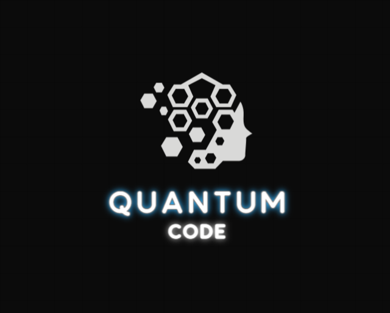

<h1 align="center"> Quantum Code <h1>
 
<div align="center">  </div>
 
## 📋 Table of contents
  - [Description](#description)
  - [Documentation](#docs)
  - [How to run](#install)
  - [Technologies](#technologies)
  - [Collaborators](#collaborators)
<br></br>
## 🔍 Description <a name="description"></a>
<p> 1. Number Wordle
Guess the hidden number within a limited number of attempts, using hints about correct and misplaced digits.

2. Guess The Number
Find the randomly generated number by receiving hints if your guess is higher or lower.

3. Guess the Puzzle
Solve a riddle or complete a missing word/phrase using given letters or clues.

4. Maths Test
Answer math questions to test your speed and accuracy at various difficulty levels. </p>
<br>
 
## 📃 Documentation <a name="docs"></a>
 
### Documentation
 
[ Documentation](https://codingburgas-my.sharepoint.com/:w:/g/personal/gvlitsanowski23_codingburgas_bg/EaLVUubne4VAjRTHSAFY8hMBv5t6rflX-iU20n68C6Dmgg?e=0yIxnR)

### Presentation
[Presentation](https://codingburgas-my.sharepoint.com/:p:/g/personal/gvlitsanowski23_codingburgas_bg/EdbJRj33zV9Fh5vakgcFBIkBir99-7ks09U7Ol3WJkbXpA?e=Drr81v)
<br></br>
## 🚀 How to run <a name="install"></a>
*The following instructions are going to show you how to set up the project*
 
- Installation
<br></br>
1. Clone the repo:
```
  git clone https://github.com/codingburgas/sprint-math-games-9th-grade-quantumcode.git
```
 
2. Run with IDE of choice
<br></br>
## 🖥️ Technologies used <a name="technologies"></a>
 
### IDE & version control system:
 
<a href="https://code.visualstudio.com/"></a>
<a href="https://github.com/"></a>
<br></br>
### Programming languages & third-party libraries:
 
</a>
 
<a href="https://cplusplus.com/"> </a>
<br></br>
### Tools used for documantation, presentation & communication:
 
<a href="https://visualstudio.microsoft.com/ru/"></a>
<a href="https://github.com/codingburgas/sprint-math-games-9th-grade-quantumcode"></a>
<a href="https://www.microsoft.com/en-us/microsoft-teams/group-chat-software"></a>
<br></br>
<br></br>
## 🧑 Collaborators <a name="collaborators"></a>
- [David Papazyan](https://github.com/DHPapazian) - Back-end Developer
- [Kirill Zhilichev](https://github.com/KAGilichev) - Back-end Developer
- [Konstantin Turmanov](https://github.com/KSTurmanov) - Scrum Trainer
- [Georgi Litsanovski](https://github.com/GVLitsanowski) - Back-end Developer
